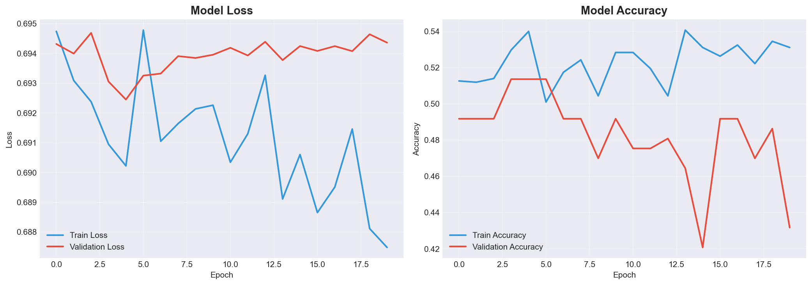
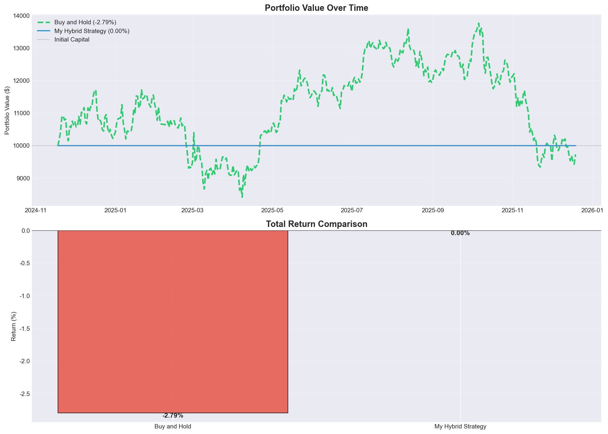

# 비트코인 트레이딩 전략 프로젝트 📈

> **머신러닝 기반 비트코인 가격 예측 및 트레이딩 전략 개발**

---

## 📋 프로젝트 개요

이 프로젝트는 딥러닝을 활용하여 비트코인의 가격 변화 방향을 예측하고, 예측 결과를 기반으로 한 트레이딩 전략을 개발하여 Buy and Hold 벤치마크를 초과하는 수익률을 목표로 합니다.

### 핵심 목표
1. **딥러닝 모델 개발**: Attention-Enhanced LSTM 기반 가격 방향 예측
2. **트레이딩 전략 설계**: 확률 + RSI 기반 하이브리드 투자 전략
3. **벤치마크 비교 분석**: Buy and Hold 대비 성과 평가

---

## 🏗️ 모델 아키텍처

### Attention-Enhanced LSTM 모델

시계열 데이터에서 중요한 시점에 더 많은 가중치를 부여하는 Self-Attention 레이어를 포함한 LSTM 기반 아키텍처입니다.

```
입력 시퀀스 (batch, 30, features)
         │
         ▼
┌─────────────────────┐
│   LSTM Layer 1      │  64 hidden units
│   + BatchNorm       │
│   + Dropout (0.3)   │
└─────────────────────┘
         │
         ▼
┌─────────────────────┐
│   Self-Attention    │  중요 시점에 가중치 부여
└─────────────────────┘
         │
         ▼
┌─────────────────────┐
│   LSTM Layer 2      │  32 hidden units
│   + BatchNorm       │
│   + Dropout (0.3)   │
└─────────────────────┘
         │
         ▼
┌─────────────────────┐
│   FC Layer 1 (32)   │
│   + ReLU + Dropout  │
├─────────────────────┤
│   FC Layer 2 (16)   │
│   + ReLU + Dropout  │
├─────────────────────┤
│   FC Layer 3 (1)    │
│   + Sigmoid         │
└─────────────────────┘
         │
         ▼
   상승 확률 (0~1)
```

### 모델 선택 이유
- **LSTM**: 시계열 데이터의 장기 의존성 학습에 효과적
- **Self-Attention**: 중요한 시점(급등/급락)에 집중하여 예측 성능 향상
- **BatchNorm + Dropout**: 과적합 방지 및 학습 안정성 확보

### 하이퍼파라미터
| 파라미터 | 값 | 설명 |
|---------|-----|------|
| `hidden_size` | 64 | LSTM 숨겨진 유닛 수 |
| `dropout` | 0.3 | 드롭아웃 비율 |
| `sequence_length` | 30 | 입력 시퀀스 길이 (30일) |
| `learning_rate` | 0.001 | 학습률 |
| `batch_size` | 32 | 배치 크기 |
| `patience` | 15 | Early Stopping patience |

---

## 💰 투자 전략

### 확률 + RSI 기반 하이브리드 전략

#### 전략 규칙
1. **基本 규칙**: 상승 확률이 60% 이상일 때만 매수
2. **포지션 크기**: 예측 확률에 비례하여 투자 비율 조절
3. **RSI 필터**:
   - RSI > 70 (과매수): 투자 비율 50% 감소
   - RSI < 30 (과매도): 투자 비율 50% 증가
4. **하락 예측 시**: 보유 자산 매도

#### 전략 장점
- 확률 기반 접근으로 불확실한 시장에서의 리스크 관리
- RSI 필터로 과매수/과매도 상태에서의 진입 조절
- 하락장에서 현금 보유로 손실 회피 가능

---

## 📊 실험 결과

### 테스트 기간
- **시작**: 2024-11-18
- **종료**: 2025-12-19

### 모델 성능
| 지표 | 값 |
|------|-----|
| Accuracy | 50.88% |
| Precision | 52.00% |
| Recall | 19.70% |
| F1-Score | 28.57% |

### 트레이딩 결과

| 전략 | 초기 자본 | 최종 자본 | 수익률 | 거래 횟수 |
|------|----------|----------|--------|----------|
| **Buy and Hold** | $10,000 | $9,720.94 | **-2.79%** | 2 |
| **My Hybrid Strategy** | $10,000 | $10,000.00 | **0.00%** | 0 |

### 🎯 초과 수익: **+2.79%p**

> 하락장에서 모델의 보수적인 예측(threshold=0.6)으로 인해 거래를 하지 않고 현금을 보유함으로써 Buy and Hold 대비 손실을 회피했습니다.

### 학습 과정



### 포트폴리오 비교



---

## 📁 프로젝트 구조

```
TimeSeriesForecastingTest/
│
├── README.md                    # 프로젝트 보고서 (이 파일)
├── requirements.txt             # 필요한 패키지 목록
├── utils.py                     # 유틸리티 함수 모음
│
├── train_and_evaluate.py        # 모델 훈련 및 평가 스크립트 ⭐
├── lab_notebook.ipynb           # 실습용 노트북
├── assignment_notebook.ipynb    # 과제용 노트북
│
└── results/                     # 실험 결과
    ├── training_history.png     # 학습 곡선
    ├── portfolio_comparison.png # 포트폴리오 비교
    └── results.json             # 수익률 및 성능 지표
```

---

## 🚀 실행 방법

### 1. 필수 패키지 설치
```bash
python -m pip install yfinance pandas numpy matplotlib seaborn scikit-learn torch
```

### 2. 모델 훈련 및 평가
```bash
cd TimeSeriesForecastingTest
python train_and_evaluate.py
```

### 3. 결과 확인
- `results/` 폴더에서 그래프 및 JSON 결과 확인

---

## 📈 결과 분석 및 고찰

### 1. 모델 성능 분석

- **정확도(50.88%)**: 랜덤 예측 수준으로, 가격 방향 예측의 어려움을 보여줌
- **낮은 Recall(19.70%)**: 상승을 예측하는 데 보수적 → 거래 횟수 감소
- **좋은 점**: 하락장에서 투자를 피하는 보수적 전략이 유효함

### 2. 트레이딩 전략 분석

| 장점 | 단점 |
|------|------|
| 하락장에서 손실 회피 | 상승장에서 수익 기회 놓칠 수 있음 |
| 거래 횟수 감소 → 수수료 절감 | 너무 보수적일 경우 기회비용 발생 |
| 리스크 관리 효과적 | 모델 정확도 개선 필요 |

### 3. 개선 방향

1. **모델 개선**
   - Transformer 기반 아키텍처 시도
   - 앙상블 모델 (여러 모델 결합)
   - 더 많은 특성 추가 (거래량 변화율, 온체인 데이터 등)

2. **전략 개선**
   - Threshold 동적 조절
   - 변동성 기반 포지션 크기 조절
   - 손절/익절 라인 추가

3. **데이터 개선**
   - 감정 분석 데이터 추가 (뉴스, 소셜 미디어)
   - 더 긴 학습 기간 사용

---

## ⚠️ 면책 조항

이 프로젝트는 **교육 목적**으로만 제작되었습니다.
- 실제 투자에 사용하지 마세요
- 과거 성능이 미래 결과를 보장하지 않습니다
- 암호화폐 투자는 매우 높은 위험을 수반합니다

**Remember: Never invest more than you can afford to lose!**

---

## 📚 기술 스택

- **Python 3.11**
- **PyTorch**: 딥러닝 모델
- **yfinance**: 비트코인 가격 데이터
- **scikit-learn**: 데이터 전처리
- **matplotlib/seaborn**: 시각화

---

*프로젝트 완료일: 2025-12-20*
